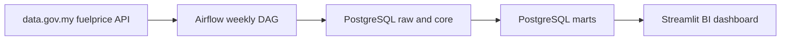

# Malaysia Fuel Price Analytics Pipeline

An end-to-end portfolio study using the Malaysian government's [weekly retail fuel prices](https://data.gov.my/data-catalogue/fuelprice). An Apache Airflow DAG retrieves a full `level` series snapshot from the [data.gov.my catalogue API](https://developer.data.gov.my/static-api/data-catalogue), validates it, and publishes raw records, a weekly table, and two analytics marts in PostgreSQL. A Streamlit dashboard queries the marts directly.

## Architecture



| Layer | Table | Grain and purpose |
| --- | --- | --- |
| Raw | `raw.fuel_price_api` | One original API JSON object per effective date and run; historical load audit |
| Core | `core.fuel_price_weekly` | One validated effective date, with nullable prices in RM per litre |
| Mart | `mart.fuel_price_long` | One effective date and fuel category, with previous level and weekly change |
| Mart | `mart.fuel_monthly` | One month and category, with mean/min/max and observation count |
| Audit | `mart.pipeline_runs` | One successful load, row count and covered date range |

## Run locally

Requires Docker Engine and Compose v2. From this repository:

```bash
cp .env.example .env
docker compose up --build -d
docker compose ps
```

Open [Airflow](http://localhost:8080) and sign in with `admin` / `admin` (change these values in `.env` for any shared machine). Unpause `malaysia_fuel_price_analytics` and click **Trigger DAG** to ingest immediately. The automatic schedule is Wednesday 12:00 UTC; `catchup=False` avoids historical backfill. The DAG retries transient failures twice, five minutes apart. Then open the [dashboard](http://localhost:8501). It displays a waiting message before the first successful load.

The warehouse is reachable at `localhost:5433`, database/user `warehouse`, password from `.env`. Airflow uses a separate PostgreSQL metadata database. Local ports bind to loopback. Stop with `docker compose down`; add `-v` only when you intend to erase the database volumes. The defaults in `.env.example` are for a disposable local demonstration; do not commit your `.env`.

## Study cases

1. **Latest price and weekly movement:** compare each category's latest level with its previous published level, in RM per litre.
2. **Long-run trend:** inspect weekly price levels and identify regime shifts around policy changes.
3. **Monthly average and movement:** compare observed-week means and the sample standard deviation of weekly changes by category. Missing weeks and changing publication frequency can affect averages.
4. **Regional diesel gap:** subtract East Malaysia diesel from Peninsular diesel only when both prices are present on the same date.

The dashboard filters categories and dates, exposes the source records, and reports the latest pipeline load. It reads SQL marts, not a bundled CSV or hardcoded chart values.

## Data contract and quality

The API request is a single `GET /data-catalogue?id=fuelprice&filter=level@series_type&limit=10000`. The [API rate limit](https://developer.data.gov.my/rate-limit) is four requests per minute; a snapshot load uses one request. The pipeline rejects empty/truncated responses, duplicate or invalid effective dates, wrong series types, nonpositive or nonfinite prices, snapshots shorter than 20 weeks, and data whose latest effective date is over 35 days old. Fields absent before a policy/category was introduced stay `NULL`; only observed values become rows in the long mart. If the API grows to 10,000 rows, the DAG fails and requires a reviewed pagination change rather than silently dropping history.

After validation, raw ingestion, replacement of current core/marts, and run audit happen in **one PostgreSQL transaction**. Failed SQL rolls back the replacement. A rerun preserves earlier raw audit rows, while the current analytical tables reflect the latest complete source snapshot. The warehouse only records successful loads. Dashboard monthly buckets use the month of the price's effective date, and weekly change means the difference from the preceding observed level for that category; it is not a percentage or a government-provided `change_weekly` series.

Sample analyst queries:

```sql
SELECT effective_date, fuel_type, price_rm_litre, weekly_change
FROM mart.fuel_price_long
WHERE fuel_type = 'RON95'
ORDER BY effective_date DESC LIMIT 12;

SELECT month, fuel_type, avg_price_rm_litre, observations
FROM mart.fuel_monthly
WHERE fuel_type IN ('Diesel Peninsular', 'Diesel East Malaysia')
ORDER BY month DESC, fuel_type LIMIT 24;
```

## Verify and troubleshoot

```bash
python -m pip install -r requirements-dev.txt
python -m pytest -q
python -m compileall -q dags pipeline dashboard
docker compose config -q
docker compose logs airflow-scheduler --tail=100
```

If the DAG fails, inspect its task log in Airflow. A stale dataset, API schema change, missing database credentials, or rate limiting should fail visibly. The official API must be reachable from the machine running Docker. The project does not include a historical data dump or mock a successful production load.

## Interpretation and attribution

Fuel prices are regulated; [diesel subsidy reform in June 2024 and the later RON95/BUDI95 distinction](https://data.gov.my/data-catalogue/fuelprice) introduce structural breaks. Price gaps and before/after comparisons are descriptive and do not establish causality. Date means effective date, not fetch date; dashboard freshness shows both. Currency is Malaysian ringgit per litre. Source: Government of Malaysia, data.gov.my `fuelprice`, [CC BY 4.0](https://creativecommons.org/licenses/by/4.0/). This repository is a reproducible educational case study and is not an official government product.
